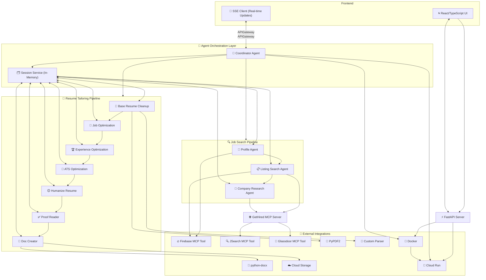

# 🚀 GetHired

**GetHired** is an AI-powered job search platform designed to automate and streamline every stage of the job hunt. Leveraging intelligent agents, the platform performs job discovery, company research, and personalized resume tailoring to improve application outcomes and reduce manual effort.

---

## Intelligent Agent Overview

### 🕵️‍♀️ Job Discovery Agent

* Searches top job boards (e.g., LinkedIn, Indeed) using user-defined keywords, location, and preferences.
* Learns user preferences over time to improve recommendation relevance.
* Ranks jobs based on:

  * Salary potential
  * Role alignment
  * Company reputation

### 📝 Resume Tailoring Agent

* Analyzes job descriptions to extract required skills and qualifications.
* Recommends resume edits to enhance alignment and keyword match.
* Auto-generates personalized cover letters based on job context and tone.
* Auto-generates resume for specified jobs pulling data from users profile stored in Firebase to include only relevant experience and skills.

### 🧠 Company Research Agent

* Compiles insights on company culture, employee reviews, benefits, and salary range.

### 📬 Job Coach Agent

* Learns user preferences over time
* Sends reminders for follow-ups and interview prep
* Logs progress in Firestore

### ⏰ Scheduled Search System

* Automated job searches with customizable schedules (daily/weekly/monthly)
* Smart email notifications with job results
* Cloud Tasks integration for reliable scheduling
* Timezone-aware with quiet hours support
* See [SCHEDULED\_SEARCH\_README.md](SCHEDULED_SEARCH_README.md) for detailed documentation

---

## Coordinator Agent

---

### 🧠 Multi-Agent AI Job Search & Resume Tailoring Architecture


---

## ⚙️ How We Built It

### Tech Stack

* **Agent Framework**: [Google Agent Development Kit (ADK)](https://github.com/google/agent-development-kit) in Python
* **Prompt Engineering**:
* **Cloud Infrastructure**:

  * **Vertex AI** for LLM-driven intelligence, reasoning, and content generation.
  * **Firestore** to persist data on job listings, resumes, user preferences, and research
  * **Cloud Run** used to deploy agent
    
* **Custom MCP Server**:

  * Provides access to tools that agents utilize to complete tasks. [Here](https://github.com/justliya/GetHired_MCP)

---

## 🌟 What Makes GetHired Unique

* Multi-agent design: Each agent specializes in a key stage of the job application process.
* AI-driven personalization: Tailored output at every step — from job match to resume and company research.
* Scalable, modular architecture: Easy to expand with new agents (e.g., interview coaching, skill gap analysis).

---

## 🧹 Frontend Setup & Installation

### Prerequisites

* Node.js v16+
* npm

### Steps

1. **Clone the repository**

   ```bash
   git clone https://github.com/justliya/GetHired.git
   ```

2. **Install dependencies**

   ```bash
   npm install
   ```

3. **Configure environment variables**

* Create a `.env` file in the root directory:

  ```env
  VITE_FIREBASE_API_KEY=<YOUR_PROJECT>
  VITE_FIREBASE_AUTH_DOMAIN=<YOUR_PROJECT>
  VITE_FIREBASE_PROJECT_ID=<YOUR_PROJECT>
  VITE_FIREBASE_STORAGE_BUCKET=<YOUR_PROJECT>
  VITE_FIREBASE_MESSAGING_SENDER_ID=<YOUR_PROJECT>
  VITE_FIREBASE_APP_ID=<YOUR_PROJECT>
  ```

4. **Run the development server**

   ```bash
   npm run dev
   ```

---

## 🧠 Backend Setup & Installation

### Prerequisites

* Python 3.11+
* A Google Cloud Platform (GCP) project
* A Firebase project
* IAM Permission: Vertex AI User

### Configuration

* **Add** your **Firebase service account key** to the `jobsearch_agents` folder
* Create a `.env` file in the backend root:

  ```env
  GOOGLE_GENAI_USE_VERTEXAI=True
  GOOGLE_CLOUD_PROJECT=<YOUR_PROJECT>
  GOOGLE_CLOUD_LOCATION=us-central1
  SERVICE_ACCOUNT_KEY_PATH=<YOUR_FIREBASE_SERVICE_KEY_PATH>
  FIREBASE_STORAGE_BUCKET=<YOUR_BUCKET>
  ```

### Authenticate with Google Cloud

```bash
gcloud auth application-default login
```

### Create and activate a virtual environment

```bash
python -m venv .venv
```

**Mac/Linux:**

```bash
source .venv/bin/activate
```

**Windows CMD:**

```cmd
.venv\Scripts\activate.bat
```

**Windows PowerShell:**

```powershell
.venv\Scripts\Activate.ps1
```

### Navigate to the backend directory

```bash
cd jobsearch_agents
```

### Set environment variables

```bash
export GOOGLE_GENAI_USE_VERTEXAI=True
export GOOGLE_CLOUD_PROJECT=<YOUR_PROJECT>
export GOOGLE_CLOUD_LOCATION=us-central1
```

### Running the agent server for testing

Start the agent server with:

```bash
python -m coordinator
```

The server should output something like:

```
INFO:__main__:Starting Coordinator Agent A2A Server initialization...
INFO:__main__:Agent timeout set to: 60.0 seconds
INFO:__main__:Agent instance created: coordinator_agent
INFO:coordinator.task_manager:Initializing TaskManager for agent: coordinator_agent 
INFO:coordinator.task_manager:ADK Runner initialized for app 'jobsearch_agents'
INFO:__main__:Coordinator Agent A2A server starting on 0.0.0.0:8003
INFO:     Started server process [35570]
INFO:     Waiting for application startup.
INFO:     Application startup complete.
INFO:     Uvicorn running on http://0.0.0.0:8003 (Press CTRL+C to quit)
```

### Test in browser

Open your browser and go to:

```
http://0.0.0.0:8003/docs
```

